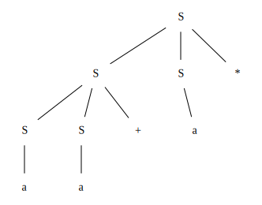

# 4.2 节的练习

### 4.2.1: 考虑上下文无关文法:

```
S -> SS+ | SS* | a
```

以及串 aa+a*。

1. 给出这个串的一个最左推导。
2. 给出这个串的一个最右推导。
3. 给出这个串的一棵语法分析树。
4. 这个文法是否为二义性的？证明你的回答。
5. 描述这个文法生成的语言。

#### 解答
1. S=>SS*=>SS+S*=>aS+S*=>aa+S*=>aa+a*
2. S=>SS*=>Sa*=>SS+a*=>Sa+a*=>aa+a*
3. 


4. 无二义性的。
5. 操作数为a，操作符为+和*的逆波兰表达式

### 4.2.2: 对下列的每一对文法和串重复练习4.2.1
1. S -> 0S1 | 01 和串000111
* 最左推导：S=>0S1=>00S11=>000111
* 最右推导：S=>0S1=>00S11=>000111
* 语法分析树：略
* 无二义性
* 左边n和0，右边n个1

2. S->+SS|*SS|a和串+*aaa
* 最左推导：S=>+SS=>+*SSS=>+*aSS=>+*aaS=>+*aaa
* 最右推导：S=>+SS=>+Sa=>+*SSa=>+*Saa=>+*aaa
* 语法分析树：略
* 无二义性
* 叶子节点为a，非叶子节点为+或*的二叉树的前序遍历得到的结果

3. S->S(S)S|ε和串(()())
* 最左推导：S=>S(S)S=>(S)S=>(S(S)S)S=>((S)S)S=>(()S)S=>(()S(S)S)S=>(()(S)S)S=>(()()S)S=>(()())S=>(()())
* 最右推导：S=>S(S)S=>S(S)=>S(S()S)=>S(S()S(S)S)=>S(S()S(S))=>S(S()S())=>S(S()())=>S(()())=>(()())
* 语法分析树：略
* 有二义性，串()()存在两个不同的语法分析树
* 所有匹配的括号对

4. TODO: 

### 4.2.3: 为下面的语言设计文法：
1. 所有由0和1组成的并且0之后都至少跟着一个1的串的集合。

```
S -> AS | A
A -> BA |
	 B  |
	 1A |
	 1
B -> 0C
C -> 1C | 1
```
2. 所有由0和1组成的回文的集合，也就是从前面和从后面读都相同的串的集合。
```
S -> 0S0 |
     1S1 |
     0   |
     1   |
     ε
```

3. 所有由0和1组成的具有相同多个0和1的串的集合。
```
S -> 0S1S |
     1S0S |
     ε
```
4. 所有由0和1组成的并且0的个数和1的个数不同的串的集合。
```
S -> 0A | A0 | 1A | A1
A -> 0A1A | 1A0A | ε
```
5. 所有由0和1组成的且其中不包含子串011的串的集合。

6. 所有由0和1组成的形如xy的串的集合，其中x≠y且x和y等长

#### TODO: 4.2.4 - 4.2.8