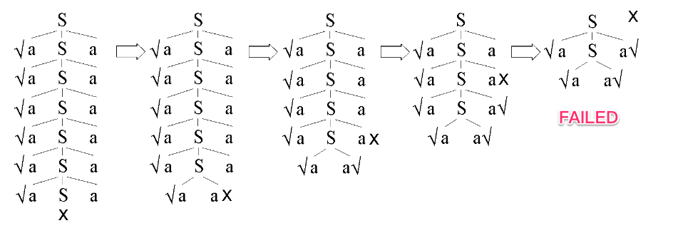
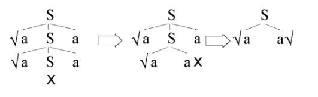
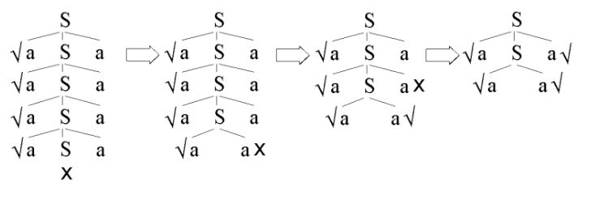
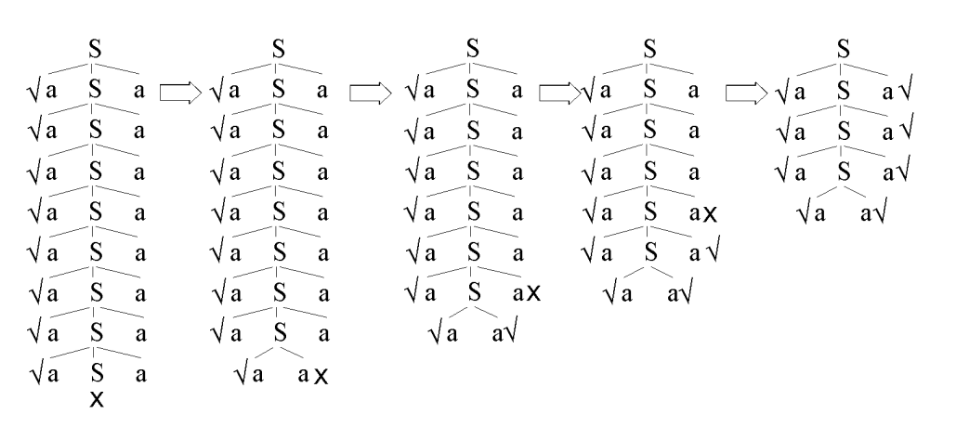

# 4.4 节的练习

### 4.4.1: 为下面的每一个文法设计一个预测分析器，并给出预测分析表。你可能先要对文法进行提取左公因子或消除左递归的操作。

#### 解答

1. S -> 0S1 | 01

首先提取左公因子得到以下文法：
```
S -> 0S'
S' -> S1 | 1
```

其中各个非终结符号的FIRST集合和FOLLOW集合如下所示：

| | FIRST | FOLLOW |
|--|:------:|:-----:|
|S| { 0 } | { 1 , $ } |
|S'| { 0 , 1 } | { 1 , $ } |

因此可以构造出以下对应的预测分析器：

| | 0 | 1 | $ |
|:-:|:------:|:-----:|:-:|
|S| S -> 0S' |  |  |
|S'| S' -> S1 | S' -> 1 |  |

2. S -> +SS | *SS | a

文法的预测分析表如下所示：

| | + | * | a | $ |
|:-:|:------:|:-----:|:-:|:-:|
|S| S -> +SS | S -> *SS | S->a |  |


3. S -> S(S)S | ε

首先消除左递归得到以下文法：
```
S  -> S'
S' -> (S)SS' | ε
```

文法的FIRST和FOLLOW集合如下所示：

| | FIRST | FOLLOW |
|--|:------:|:-----:|
|S| { ( , ε } | { ( , ) , $ } |
|S' | { ( , ε } | { ( , ) , $ } |

因此可以构造出以下对应的预测分析器：

<table>
	<tbody>
		<tr>
           	<td></td>
			<td>(</td>
			<td>)</td>
			<td>$</td>
		</tr>
		<tr>
            <td>S</td>
			<td>S->S'</td>
			<td>S->S'</td>
			<td>S->S'</td>
		</tr>
		<tr>
            <td>S'</td>
			<td>S'->(S)SS'<br/>S'-> ε</td>
			<td>S'-> ε</td>
			<td>S'-> ε</td>
		</tr>
	</tbody>
</table>


4. S -> S+S | SS | (S) | S* | a

首先消除左递归得到以下文法：
```
S  -> (S)S' | aS'
S' -> +SS' | SS' | *S' | ε
```
文法的FIRST和FOLLOW集合如下所示：

| | FIRST | FOLLOW |
|--|:------:|:-----:|
|S| { ( , a } | { + , ( , ) , a , * , $ } |
|S' | { + , ( , a, *, ε } | { + , ( , ) , a , * , $ } |

因此可以构造出以下对应的预测分析器：

<table>
	<tbody>
		<tr>
           	<td></td>
			<td>(</td>
			<td>)</td>
			<td>+</td>
			<td>*</td>
			<td>a</td>
			<td>$</td>
		</tr>
		<tr>
            <td>S</td>
			<td>S -> (S)S'</td>
			<td></td>
			<td></td>
			<td></td>
			<td>S -> aS'</td>
			<td></td>
		</tr>
		<tr>
            <td>S'</td>
			<td>S' -> SS'<br />S' -> ε</td>
			<td>S' -> ε</td>
			<td>S' -> +SS'<br />S' -> ε</td>
			<td>S' -> *S'<br />S' -> ε</td>
			<td>S' -> SS'<br />S' -> ε</td>
			<td>S' -> ε</td>
		</tr>
	</tbody>
</table>


5. S -> (L) | a 以及 L -> L, S | S

首先消除左递归得到以下文法：

```
S  -> (L) | a
L -> SL'
L' -> ,SL' | ε
```

文法的FIRST和FOLLOW集合如下所示：

| | FIRST | FOLLOW |
|--|:------:|:-----:|
|S | { ( , a } | { ',' , )} |
|L | { ( , a } | { ) } |
|L'  | { ',' , ε } | { ) } |

因此可以构造出以下对应的预测分析器：

| | ( | ) | a | , | $ |
|:-:|:------:|:-----:|:-:|:-:|:-:|
|S| S -> (L) |  | S -> a |  |  |
|L| L -> SL' |  | L -> SL' |  |  |
|L'|  | L' -> ε | | L' -> ,SL' |  |

7. 布尔表达式的文法

```
bexpr -> bexpr or bterm | bterm
bterm -> bterm and bfactor | bfactor
bfactor -> not bfactor | (bexpr) | true | false
```

首先消除左递归得到以下文法：
```
bexpr -> bterm bexpr'
bexpr' -> or bterm bexpr' | ε
bterm -> bfactor bterm'
bterm' -> and bfactor bterm' | ε
bfactor -> not bfactor | (bexpr) | true | false
```
文法的FIRST和FOLLOW集合如下所示：

| | FIRST | FOLLOW |
|:-:|:------:|:-----:|
|bexpr| { not , ( , true , false } | { ) , $ } |
|bexpr' | { or , ε } | { ) , $ } |
|bterm | { not , ( , true , false } | { or , ) , $ } |
|bterm' | { and , ε } | { or , ) , $ } |
|bfactor | { not , ( , true , false } | { and , or , ) , $ } |


因此可以构造出以下对应的预测分析器：

| | not | true | false | or | and | ( | ) | $ |
|:-:|:------:|:-----:|:-:|:-:|:-:|:-:|---|:-:|
|bexpr| bexpr -> bterm bexpr' | bexpr -> bterm bexpr' | bexpr -> bterm bexpr' |  |  | bexpr -> bterm bexpr' |  |  |
|bexpr'|  |  |  | bexpr' -> or bterm bexpr' |  |  | bexpr' -> ε | bexpr' -> ε |
|bterm| bterm -> bfactor bterm' | bterm -> bfactor bterm' | bterm -> bfactor bterm' |  |  | bterm -> bfactor bterm' |  |  |
|bterm'| |  | | bterm' -> ε | bterm' -> and bfactor bterm' | | bterm' -> ε | bterm' -> ε |
|bfactor| bfactor -> not bfactor | bfactor -> true | bfactor -> false |  | | bfactor -> (bexpr) |  |  |


### 4.4.2: 有没有可能通过某种方法修改练习4.2.1中的文法，构造出一个与该练习中的语言(运算分量为a的后缀表达式)对应的预测分析器？

#### 解答

首先通过消除左递归和提取公因子将文法修改为
```
S  -> aS'
S' -> SA | ε
A  -> +S' | *S' 
```
其中各个非终结符号的FIRST集合和FOLLOW集合如下所示：

| | FIRST | FOLLOW |
|--|:------:|:-----:|
|S| { a } | { $ , + , * } |
|S'| { a , ε } | { $ , + , * } |
|A|{ + , * }|{ $ , + , * }|

因此可以构造出以下对应的预测分析器：

| | a | + | * | $ |
|--|:------:|:-----:|:-:|:-:|
|S| S -> aS' |  |  |  |
|S'| S' -> SA | S' -> ε | S' -> ε | S' -> ε |
|A||A -> +S'| A -> *S' |  |

### 4.4.3: 计算练习4.2.1的文法的FIRST和FOLLOW集合。
```
S -> SS+ | SS* | a
```
#### 解答

| | FIRST | FOLLOW |
|--|:------:|:-----:|
|S| { a } | { $ , + , * } |

### 4.4.4: 计算练习4.2.2中各个文法的FIRST和FOLLOW集合。
#### 解答
1. S -> 0S1 | 01

| | FIRST | FOLLOW |
|--|:------:|:-----:|
|S| { 0 } | { 1 } |

2. S -> +SS | *SS | a

| | FIRST | FOLLOW |
|--|:------:|:-----:|
|S| { + , * , a } | { + , * , a } |

3. S -> S(S)S | ε

首先消除左递归得到以下文法：
```
S  -> S'
S' -> (S)SS' | ε
```
文法的FIRST和FOLLOW集合如下所示：

| | FIRST | FOLLOW |
|--|:------:|:-----:|
|S| { ( , ε } | { ( , ) , $ } |
|S' | { ( , ε } | { ( , ) , $ } |

4. S -> S + S | SS | (S) | S* | a

首先消除左递归得到以下文法：
```
S  -> (S)S' | aS'
S' -> +SS' | SS' | *S' | ε
```
文法的FIRST和FOLLOW集合如下所示：

| | FIRST | FOLLOW |
|--|:------:|:-----:|
|S| { ( , a } | { + , ( , ) , a , * , $ } |
|S' | { + , ( , a, *, ε } | { + , ( , ) , a , * , $ } |

5. S -> (L) | a

| | FIRST | FOLLOW |
|--|:------:|:-----:|
|S| { ( , a } | { $ } |

6. S -> aSbS | bSaS | ε

| | FIRST | FOLLOW |
|:-:|:------:|:-----:|
|S| { a , b ,  ε } | { a , b , $ } |


7. 布尔表达式对应的文法
```
bexpr -> bexpr or bterm | bterm
bterm -> bterm and bfactor | bfactor
bfactor -> not bfactor | (bexpr) | true | false
```

首先消除左递归得到以下文法：
```
bexpr -> bterm bexpr'
bexpr' -> or bterm bexpr' | ε
bterm -> bfactor bterm'
bterm' -> and bfactor bterm' | ε
bfactor -> not bfactor | (bexpr) | true | false
```
文法的FIRST和FOLLOW集合如下所示：

| | FIRST | FOLLOW |
|:-:|:------:|:-----:|
|bexpr| { not , ( , true , false } | { ) , $ } |
|bexpr' | { or , ε } | { ) , $ } |
|bterm | { not , ( , true , false } | { or , ) , $ } |
|bterm' | { and , ε } | { or , ) , $ } |
|bfactor | { not , ( , true , false } | { and , or , ) , $ } |

### 4.4.5 文法S->aSa | aa生成了所有由a组成的长度为偶数的串。我们可以为这个文法设计一个带回溯的递归下降分析器。如果我们选择先用产生式S->aa展开，那么我们只能识别到串aa。因此，任何任何合理的递归下降分析器将首先尝试S->aSa。(1)说明这个递归下降分析器识别输入aa、aaaa和aaaaaaaa，但是识别不了aaaaaa。(2)这个递归下降分析器识别什么语言？
#### 解答
1. 首先说明该递归下降语法分析器识别不了aaaaaa。

  * 开始规则S，匹配1<sup>st</sup> a。
  * 调用子过程S。
    * 匹配2<sup>nd</sup>a；
    * 继续调用子过程S，这个过程经过一系列的匹配、失败、回溯过程，最终将匹配4个a，此时输入中的6个a都得到了匹配，输入指针指向aaaaaa结尾处；
    * 尝试匹配a，但是输入指针已经到达了输入的末尾，匹配失败。所以进行回溯，尝试用S->aa进行匹配并成功匹配了2<sup>nd</sup>和3<sup>rd</sup>个a。
  * 匹配4<sup>th</sup> a。

所以在输入为aaaaaa时，该递归下降语法分析器只能匹配到前4个a，而不能识别aaaaaa。

下面的图更细致地展示了整个匹配失败的过程：



其匹配失败的原因在于当某个函数f匹配失败时，只会尝试回滚函数内部发生错误的函数或者函数f本身。当函数f的某个子过程g成功返回之后如果函数f匹配失败，f不会回滚子过程g。例如在上面图中从左至右第4幅小图中，假设从上至下的4个S分别被标记为S<sub>1</sub>，S<sub>2</sub>，S<sub>3</sub>，S<sub>4</sub>。S<sub>3</sub>成功匹配了4个a，此时输入流中的6个a全部被匹配，当函数S<sub>2</sub>继续尝试匹配规则S->aSa中的最后一个a时匹配失败，此时只会再尝试用规则S->aa来回滚S<sub>2</sub>而不会考虑用规则S->aa来回滚已经成功匹配了的子过程S<sub>3</sub>。


下面用图例说明该递归下降语法分析器能够成功识别输入aa、aaaa和aaaaaaaa。

* 当输入为aa时，匹配过程如下图所示：



* 当输入为aaaa时，匹配过程如下图所示：



* 当输入为aaaaaaaa时，匹配过程如下图所示：



2. 该递归下降分析器能识别2<sup>n</sup>个a的输入，n >= 1。


**参考链接**

*  [编译原理（龙书）习题4.4.5的一点疑问？](https://www.zhihu.com/question/37746384)
*  [How does backtracking affect the language recognized by a parser?](https://stackoverflow.com/questions/17456994/how-does-backtracking-affect-the-language-recognized-by-a-parser)
*  [C++示例代码参考](https://github.com/OkabeRintarou/DragonBook2e/blob/master/ch04/4.4/src/4.4.4.cc)

