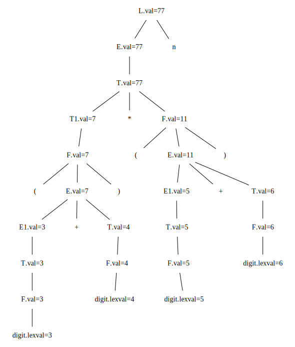
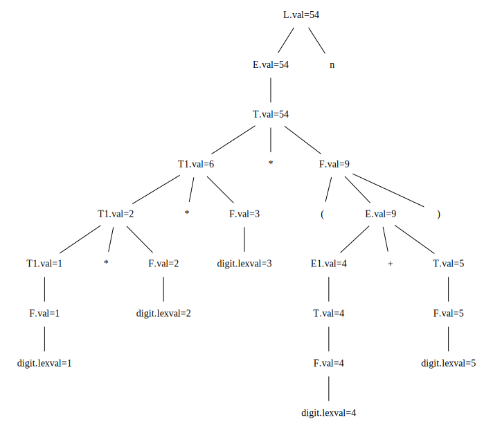
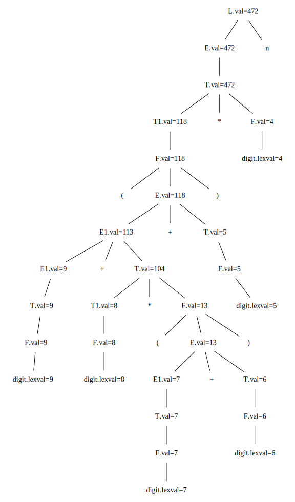
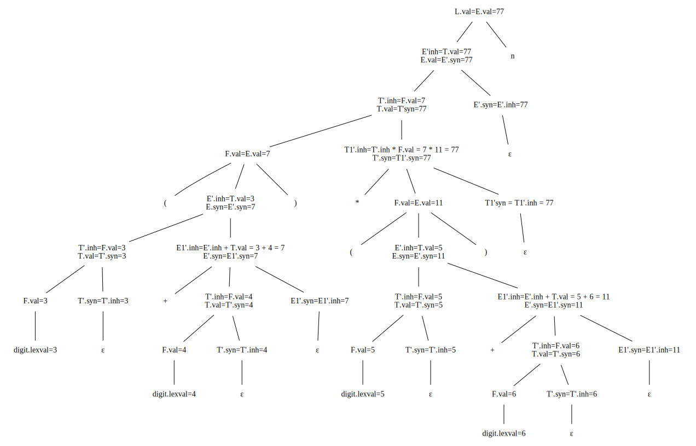
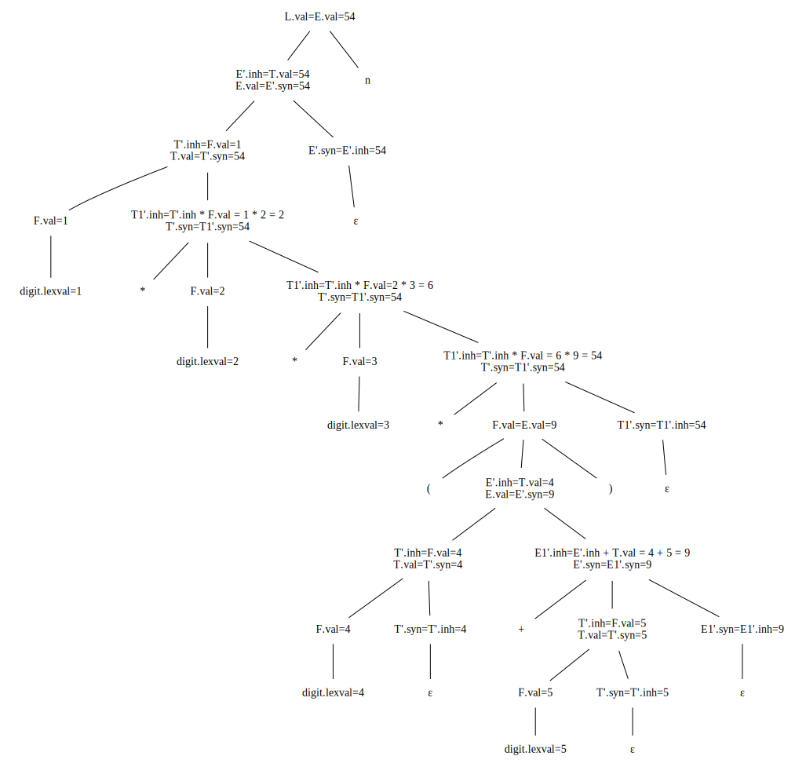
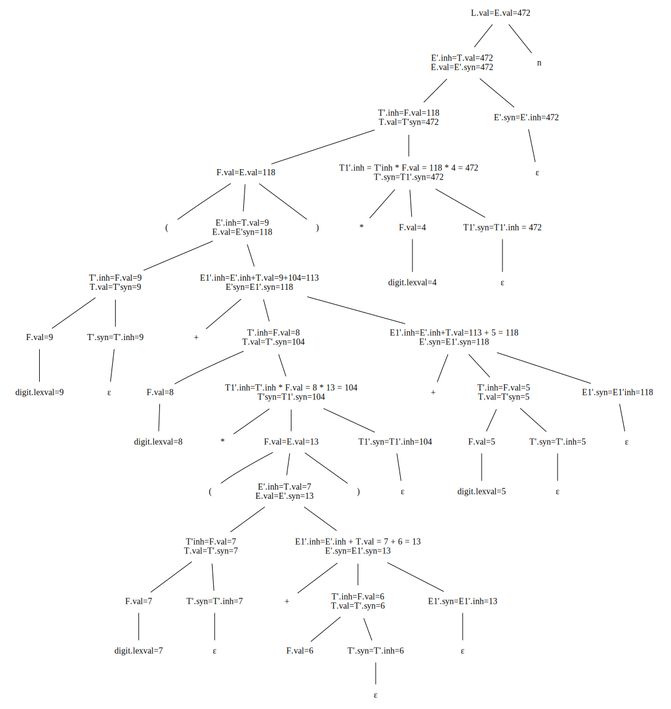

# 5.1 节的练习
### 5.1.1: 对于图5-1中的SDD，给出下列表达式对应的注释语法分析树：

1. (3 + 4) * (5 + 6)n
2. 1 * 2 * 3 * (4 + 5)n
3. (9 + 8 * (7 + 6) + 5) * 4n

#### 解答
1. 
2. 
3. 

### 5.1.2: 扩展图5-4中的SDD，使它可以像图5-1所示那样处理表达式。
#### 解答
<table>
    <thead>
    	<tr>
        	<td>产生式</td>
            <td>语义规则</td>
        </tr>
    </thead>
	<tbody>
		<tr>
			<td>(1) L -> En</td>
			<td>L.val = E.val</td>
		</tr>
		<tr>
			<td>(2) E -> TE'</td>
			<td>E'.inh = T.val E.val=E'.syn</td>
		</tr>
		<tr>
			<td>(3) E' -> +TE1'</td>
			<td>E1'.inh = E'.inh + T.val E'.syn = E1'.syn</td>
		</tr>
		<tr>
			<td>(4) E' -> ε</td>
			<td>E'.syn = E'.inh</td>
		</tr>
        <tr>
        	<td>(5) T -> FT'</td>
            <td>T'.inh = F.val T.val = T'.syn</td>
        </tr>
        <tr>
        	<td>(6) T' -> *FT1'</td>
            <td>T1'.inh = T'.inh * F.val T'.syn = T1'.syn</td>
        </tr>
        <tr>
        	<td>(7) T' -> ε</td>
            <td>T'.syn = T'.inh</td>
        </tr>
        <tr>
        	<td>(8) F -> (E) </td>
            <td>F.val = E.val</td>
        </tr>
        <tr>
        	<td>(9) F -> digit</td>
            <td>F.val = digit.lexval</td>
        </tr>
	</tbody>
</table>

### 5.1.3: 使用你在练习5.1.2中得到的SDD，重复练习5.1.1。

#### 解答

1. 

2. 

3. 

   
