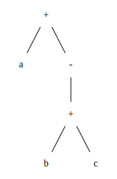

# 6.2 节的练习

### 6.2.1: 将算术表达式a+-(b+c)翻译成

#### 解答
1. 抽象语法树

2. 四元式序列

op  | arg1 | arg2 | result|
----|------|------|-------|
+   |   b  |  c   |  t1   |
minus|  t1 |      |  t2   |
+   |   a  |  t2  |  t3   |

3. 三元式序列

index  |  op  |  arg1  |  arg2  |
-------|------|--------|--------|
0      |  +   |   b    |    c   |
1      |minus |  (0)   |        |
2      |  +   |  a     |   (1)  |

4. 间接三元式序列

instruction表:

instruction |
------------|
0           |
1           |
2           |

三元式表:

index  |  op  |  arg1  |  arg2  |
-------|------|--------|--------|
0      |  +   |   b    |    c   |
1      |minus |  (0)   |        |
2      |  +   |  a     |   (1)  |

### 6.2.2 
#### 解答

### 6.2.3
#### 解答

