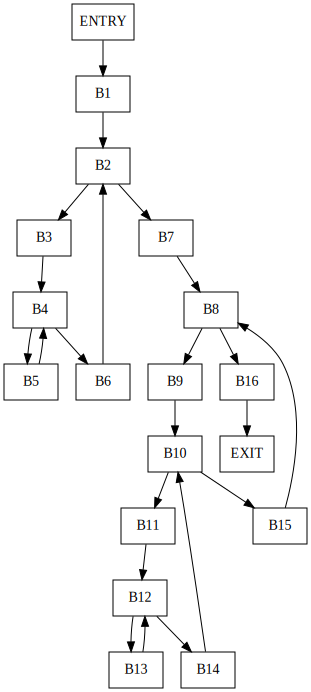

# 8.4 节的练习

### 8.4.1: 图8-10是一个简单的矩阵乘法程序。

```c
for (i = 0; i < n; i++)
    for (j = 0; j < n; j++)
        c[i][j] = 0.0;
for (i = 0; i < n; i++)
    for (j = 0; j < n; j++)
        for (k = 0; k < n; k++)
            c[i][j] = c[i][j] + a[i][k] * b[k][j];
```

1. 假设矩阵的元素是需要8个字节的数值，而且矩阵按行存放。把程序翻译成为我们本节中一直使用的那种三地址语句。
2. 为(1)中得到的代码构造流图。
3. 找出在(2)中得到的流图的循环。

#### 解答

1. 程序翻译后的三地址语句如下所示：

```assembly
B1 
   (1) i = 0
B2   
   (2) if i >= n goto (13)
B3   
   (3) j = 0
B4   
   (4) if j >= n goto (11)
B5   
   (5) t1 = i * n
   (6) t2 = t1 + j
   (7) t3 = 8 * t2
   (8) c[t3] = 0.0
   (9) j = j + 1
   (10) goto (4)   
B6  
   (11) i = i + 1
   (12) goto (2)
B7   
   (13) i = 0
B8   
   (14) if i >= n goto (39)
B9   
   (15) j = 0
B10   
   (16) if j >= n goto (37)
B11   
   (17) k = 0
B12   
   (18) if k >= n goto (35)
B13   
   (19) t4 = i * n
   (20) t5 = t1 + j
   (21) t6 = 8 * t5
   (22) t7 = c[t6]
   (23) t8 = t4 + k
   (24) t9 = 8 * t8
   (25) t10 = a[t9]
   (26) t11 = k * n
   (27) t12 = t11 + j
   (28) t13 = 8 * t12
   (29) t14 = b[t13]
   (30) t15 = t7 + t10
   (31) t16 = t15 + t14
   (32) c[t6] = t16
   (33) k = k + 1
   (34) goto (18)
B14   
   (35) j = j + 1
   (36) goto (16)
B15   
   (37) i = i + 1 
   (38) goto (14)
B16   
   (39)
```

2. 
3. 流图包含以下循环
   - B<sub>4</sub>->B<sub>5</sub>->B<sub>4</sub>
   - B<sub>2</sub>->B<sub>3</sub>->B<sub>4</sub>->B<sub>6</sub>->B<sub>2</sub>
   - B<sub>12</sub>->B<sub>13</sub>->B<sub>12</sub>
   - B<sub>10</sub>->B<sub>11</sub>->B<sub>12</sub>->B<sub>14</sub>->B<sub>10</sub>
   - B<sub>8</sub>->B<sub>9</sub>->B<sub>10</sub>->B<sub>15</sub>->B<sub>8</sub>

### 8.4.2: 图8-11是计算2~n之间素数个数的代码。它在一个适当大小的数组a上使用筛法来完成计算。也就是说，最后a[i]为真仅当没有小于等于i ^ 0.5的质数可以整除i。我们一开始把所有a[i]初始化为TRUE；如果我们找到了j的一个因子，就把a[j]设置为FALSE。

```c
for (i = 2; i <= n; i++)
    a[i] = TRUE;
count = 0;
s = sqrt(n);
for (i = 2; i <= s; i++)
    if (a[i]) {
        count++;
        for (j = 2 * i; j <= n; j = j + i)
            a[j] = FALSE;
    }
```

1. 把程序翻译成为我们本节中使用的那种三地址语句序列。这里假设一个整数需要4个字节存放。

2. 为在(1)中得到的代码构造流图。

3. 找出在(2)中得到的流图的循环。

#### 解答

1. 程序翻译后的三地址语句如下所示：