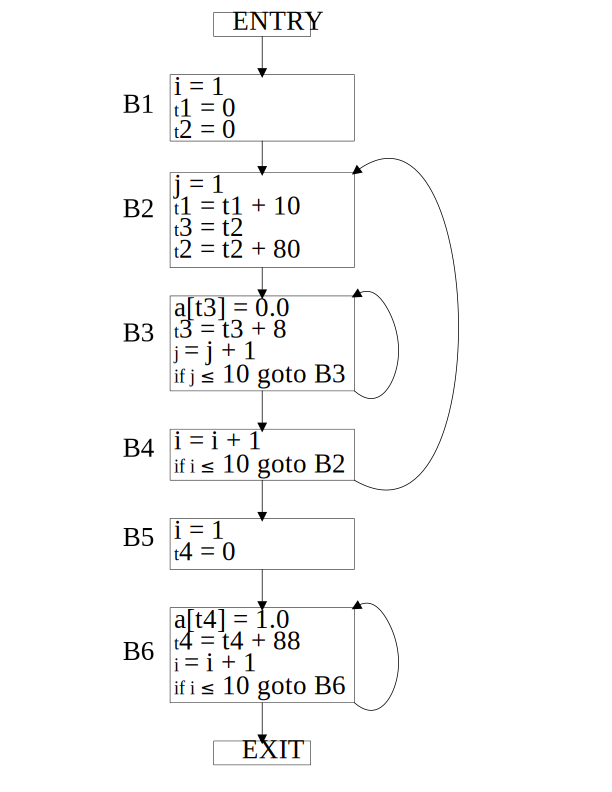

# 9.1 节的练习

### 9.1.1: 对于图9-10中的流图：

1. 找出流图中的循环

2. B1中的语句(1)和(2)都是复制语句。其中a和b都被赋予了常量值。我们可以对a和b的哪些使用进行复制传播，并把对它们的使用替换为对一个常量的使用？在所有可能的地方进行这种替换。

3. 对每个循环，找出所有的全局公共子表达式。

4. 寻找每个循环中的归纳变量。同时要考虑在(2)中引入的所有常量。

5. 寻找每个循环的全部循环不变计算。

#### 解答

1. B3, B4和B2, B3, B5 

2. 语句(3)可以替换为c=1+b，语句(4)可以替换为d=c-1，语句(6)可以替换为d=1+b，语句(8)可以替换为b=1+b，语句(9)可以替换为e=c-1。

3. 循环B3, B4中没有全局公共子表达式，循环B2, B3, B5中语句(3)和语句(8)中的a+b以及语句(4)和语句(9)中的c-a是全局公共子表达式。

4. 循环B3, B4中的归纳变量：e，循环B2, B3, B5中的归纳变量：b。

5. 循环中没有循环不变计算。

   

### 9.1.2: 把本节中的转换技术应用到图8-9中的流图上。

#### 解答

### 9.1.3: 把本节中的转换应用到练习8.4.1和8.4.2中得到的流图中去。

### 9.1.4: 图9-11中是用来计算两个向量A和B的点积的中间代码。尽你所能，通过下列方式优化代码：消除公共子表达式，对归纳变量进行强度消减，消除归纳变量。

